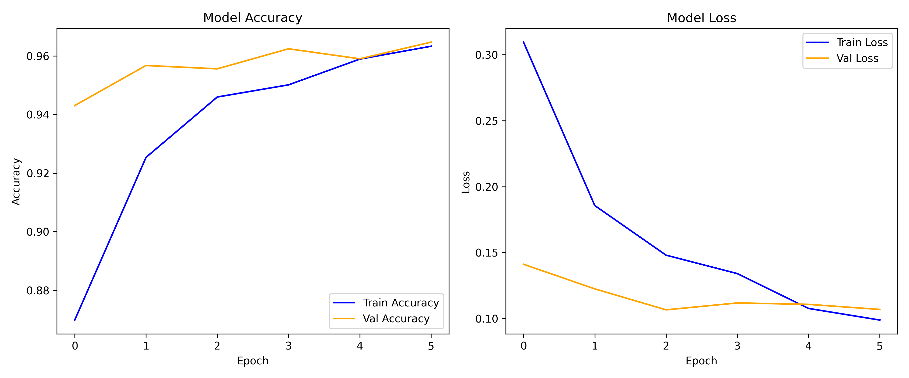

# PneumoScan — AI Pneumonia Detection

> End-of-year project (PFA): CNN + RAG pipeline for chest X-ray pneumonia detection with clinical report analysis.

[](https://www.python.org/)
[](https://fastapi.tiangolo.com/)
[](https://www.tensorflow.org/)
[](LICENSE)

A full-stack medical AI platform:
- **CNN** classifies chest X-rays (NORMAL vs PNEUMONIA) + Grad-CAM heatmap
- **RAG pipeline** extracts & analyzes PDF medical reports (PyMuPDF → ChromaDB + sentence-transformers → Gemini)
- **Fusion diagnostic** merges patient profile, RAG findings, and X-ray prediction (with identity mismatch guard)
- **FastAPI + SQLite/Postgres** backend, vanilla JS frontend

> ⚠️ **Disclaimer:** Research prototype only. Not a medical device. Does not replace professional diagnosis.

## Demo

- API: `GET /` serves the web UI, `POST /predict` for X-ray only, `POST /final-diagnostic` for full fusion
- Sample report: `sample_medical_report.pdf` (synthetic, John Doe) — regenerated via `python scripts/generate_sample_report.py`

## Results (baseline CNN)

| Metric | Validation |
|---|---|
| Accuracy | **96.47%** |
| AUC | **0.990** |
| Loss | 0.107 |

Plots: `model/artifacts/training_history.png`, `confusion_matrix.png`, `roc_curve.png`



## Architecture

```
data/raw/NORMAL|PNEUMONIA → etl/run_etl.py → data/processed → model/train_baseline.py
                                     ↓
              PDF ──parse(chroma)──▶ RAG ──┐
              X-ray ──CNN+GradCAM──► API ──┼── Fusion Diagnostic ──▶ Frontend
              Profile ──DB───────────┘     │
```

## Quickstart

```bash
# 1. Clone & venv
git clone <your-repo-url> pneumoscan && cd pneumoscan
python -m venv .venv && .venv\Scripts\activate  # Windows
# or: python3 -m venv .venv && source .venv/bin/activate

pip install -r requirements.txt

# 2. Env
cp .env.example .env   # set GEMINI_API_KEY (optional — fallback runs without it)

# 3. Data → place chest X-rays in:
#    data/raw/NORMAL/ and data/raw/PNEUMONIA/  (e.g. Chest X-Ray Images (Pneumonia) Kaggle)

# 4. ETL + Train
powershell -ExecutionPolicy Bypass -File scripts/run_etl.ps1
powershell -ExecutionPolicy Bypass -File scripts/train_baseline.ps1
# outputs: model/artifacts/baseline_pneumonia.keras, baseline_metrics.json

# 5. Run API
powershell -ExecutionPolicy Bypass -File scripts/run_api.ps1
# → http://127.0.0.1:8000  (GET /health, POST /predict, POST /final-diagnostic)
```

Alternative: `scripts/run_api.bat` or VS Code task `Run API`.

## API Endpoints

| Method | Path | Auth | Description |
|---|---|---|---|
| GET | `/` | — | Web UI |
| GET | `/health` | — | Service + model status |
| GET | `/metrics` | — | Training accuracy/AUC |
| POST | `/predict` | optional | X-ray image → `{prediction, confidence, gradcam_base64}` |
| POST | `/register`, `/token` | — | Auth (JWT) |
| POST | `/analyze-report` | ✅ | Single PDF RAG analysis |
| POST | `/process-documents` | ✅ | Multi-PDF RAG merged payload |
| POST | `/final-diagnostic` | ✅ | X-ray + PDFs + profile → fusion diagnostic |
| GET | `/history`, `/history/reports`, `/history/diagnostics` | ✅ | User history |

## Project Structure

```
api/          # FastAPI (app.py, rag.py, auth.py, models.py)
frontend/     # index.html, app.js, styles.css, history.html
etl/          # run_etl.py, config.py
model/        # train_baseline.py, evaluate.py, gradcam.py, artifacts/
scripts/      # setup.ps1, run_etl.ps1, train_baseline.ps1, run_api.* , generate_*.py
docs/         # phase_tracker.md, backlog.md
data/         # raw/ processed/ reports/  (gitignored, add your dataset)
sample_medical_report.pdf  # synthetic demo report
```

## Model Artifacts

`model/artifacts/baseline_pneumonia.keras` (128 MB) is **gitignored** (GitHub 100 MB limit).  
Recreate locally via `scripts/train_baseline.ps1` or download from **Releases** (create a release and attach the `.keras`).

Tracked: `baseline_metrics.json`, `*.png` plots. See `model/artifacts/README.md`.

## Tech Stack

Python, TensorFlow/Keras, OpenCV, scikit-learn, FastAPI, Uvicorn, SQLAlchemy, ChromaDB, sentence-transformers, PyMuPDF, Google Gemini, HTML/CSS/JS.

## Security

- No secrets in repo — use `.env` (see `.env.example`), `.env` is gitignored.
- Rotate any exposed API keys before pushing.
- `pneumoscan.db` and `data/` are gitignored — don’t commit patient data.

## Roadmap

- Phase 0–4 done (ETL, baseline CNN, API, frontend) — see `docs/phase_tracker.md`
- TODO: transfer learning, hyper-tuning, E2E tests, deployment (Docker)

## License

MIT — add a `LICENSE` file.
